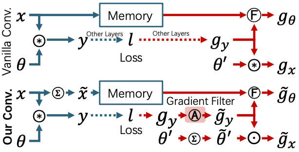

# Efficient On-device Training via Gradient Filtering

> Yuedong Yang, Guihong Li, Radu Marculescu

This is the official repo for the paper `Efficient On-device Training via Gradient Filtering` accepted in CVPR 2023.

[arxiv](https://arxiv.org/abs/2301.00330) [video](https://www.youtube.com/watch?v=UGcKdzeTAnk)

<details><summary>Abstract</summary>

Despite its importance for federated learning, continuous learning and many other applications,
on-device training remains an open problem for EdgeAI.
The problem stems from the large number of operations (*e.g.*, floating point multiplications and additions) and memory consumption required during training by the back-propagation algorithm.
Consequently, in this paper, we propose a new gradient filtering approach which enables on-device CNN model training. More precisely, our approach creates a special structure with fewer unique elements in the gradient map, thus significantly reducing the computational complexity and memory consumption of back propagation during training.
Extensive experiments on image classification and semantic segmentation with multiple CNN models (*e.g.*, MobileNet, DeepLabV3, UPerNet) and devices (*e.g.*, Raspberry Pi and Jetson Nano) demonstrate the effectiveness and wide applicability of our approach. For example, compared to SOTA, we achieve up to 19 $\times$ speedup and 77.1\% memory savings on ImageNet classification with only 0.1\% accuracy loss. Finally, our method is easy to implement and deploy; over 20 $\times$ speedup and 90\% energy savings have been observed compared to highly optimized baselines in MKLDNN and CUDNN on NVIDIA Jetson Nano. Consequently, our approach opens up a new direction of research with a huge potential for on-device training.
</details>

## Features

### Reduce Computation and Memory Complexity for Backpropagation via Gradient Filter

<p align="center">
  
</p>

Because of the high computation and memory complexity, backpropagation (BP) is the key bottleneck for CNN training. Our method reduces the complexity by introducing the gradient filter (highlighted in red in the bottom figure). The gradient filter approximates the gradient map with one consisting fewer unique elements and special structures. By doing so, operations in BP for a convolution layer can be greatly simplified, thus saving computation and memory.

### Over 10 $\times$ Speedup with Marginal Accuracy Loss 

<p align="center">
  
</p>

Our method achieves significant speedup on both edge devices (Raspberry Pi 3 and NVIDIA Jetson Nano) and desktop devices with marginal accuracy loss.

## Environment Setup

1. Create and activate conda virtual environment
    ```
    conda create -n gradfilt python=3.8
    conda activate gradfilt
    ```

2. Install PyTorch 1.13.1
    
    Here we consider a system with x86_64 CPU, Nvidia GPU with CUDA 11.7, Ubuntu 20.04 OS. For systems with different configurations, please refer to pytorch's official [installation guide](https://pytorch.org/get-started/previous-versions/).
    ```
    conda install pytorch==1.13.1 torchvision==0.14.1 pytorch-cuda=11.7 -c pytorch -c nvidia
    ```

3. Install dependencies for the classification task

    ```
    pip install "jsonargparse[signatures]" pytorch_lightning==1.6.5 torchmetrics==0.9.2 pretrainedmodels
    git clone https://github.com/mit-han-lab/mcunet.git
    cd mcunet
    git checkout be404ea0dbb7402783e1c825425ac257ed35c5fc
    python setup.py install
    cd ..
    ```

4. Install dependencies for semantic segmentation

    ```
    pip install openmim
    mim install mmcv-full==1.6.1
    cd segmentation/mmsegmentation
    pip install -e .
    ```
    The installation process for MMCV can be very slow if there is no pre-compiled `mmcv-full` package. In such case, please to MMCV [installation guide](https://mmcv.readthedocs.io/en/v1.6.0/get_started/build.html) and build MMCV from source.

5. Install dependencies for latency test

    Latency test depends on OneDNN (a.k.a. MKLDNN) v2.6 and CUDNN v8. OneDNN can be installed via conda:
    ```
    conda install -c conda-forge onednn==2.6
    ```
    For CUDNN installation, please refer to CUDNN [website](https://developer.nvidia.com/cudnn)

6. Build latency test

    ```
    cd latency
    mkdir build
    cd build
    cmake ..
    make
    ```

7. Extract pretrained / calibtrated model checkpoints and reference experiment logs
    
    Download link:
    - [Pretrained checkpoints for classification](https://utexas.box.com/s/9ah6e9kbng5bcrr9mc1nck4uzgup16of)
    - [Calibrated checkpoints for semantic segmentation](https://utexas.box.com/s/22hbnoiude6p8oysih5vci44p5m0fkt9)
    - [Experiment logs for classification](https://utexas.box.com/s/521av6l17mmyp6rq0hsqxmim72jat4le)
    - [Experiment logs for semantic segmentation](https://utexas.box.com/s/nqiwucup4b98tyrvte1mznnf99rtr2jt)

    Extract checkpoints:
    ```
    cd classification
    tar xvf <path to cls_pretrained_ckpts.tar.gz>
    cd ..
    cd segmentation
    tar xvf <path to seg_calib_ckpt.tar.gz>
    cd ..
    ```

    Extract reference experiment logs anywhere you like.

8. Setup datasets

    Classification:
    - CIFAR10/100 will be downloaded automatically under `classification/data/cifar[10|100]`
    - Download ImageNet and place the `train`, `val` folders under `classification/data/imagenet`
    
    Semantic segmentation: Please refer to [Prepare Datasets](https://mmsegmentation.readthedocs.io/en/0.x/dataset_prepare.html) for Cityscapes and Pascal VOC12 Aug.

## Experiments for Accuracy Evaluation

We provide example scripts for launching and reproducing our experimental results under `classification/scripts` and `segmentation/scripts`.

For example, to train MobileNet-V2 on CIFAR100 dataset with our gradient filter with a patch size $2\times 2$, run:

    ```
    cd classification
    bash scripts/mbv2/mbv2_cifar100_r2.sh
    ```
results are stored under `classification/runs`

Our experimental framework is config-based, so you can try different experimental setups by simply changing config files under `classification/configs` and `segmentation/configs`.

We provide the configs and launching scripts for:
- [Classification] MobileNet-V2: [configs](classification/configs/cls/mbv2), [scripts](classification/scripts/mbv2)
- [Classification] MCUNet: [configs](classification/configs/cls/mcunet), [scripts](classification/scripts/mcunet)
- [Classification] ResNet-18: [configs](classification/configs/cls/res18), [scripts](classification/scripts/res18)
- [Classification] ResNet-34: [configs](classification/configs/cls/res34), [scripts](classification/scripts/res34)
- [Segmentation] DeepLabV3-ResNet18: [configs](segmentation/configs/deeplabv3), [scripts](segmentation/scripts/example_dlv3.sh)
- [Segmentation] DeepLabV3-MobileNetV2: [configs](segmentation/configs/deeplabv3mv2)
- [Segmentation] FCN-ResNet18: [configs](segmentation/configs/fcn)
- [Segmentation] PSPNet-ResNet18: [configs](segmentation/configs/pspnet)
- [Segmentation] PSPNet-MobileNetV2: [configs](segmentation/configs/pspnetmv2)
- [Segmentation] UPerNet-ResNet18: [configs](segmentation/configs/upernet)

Launching scripts for other segmentation models can be adapted from DeepLabV3-ResNet18 by replacing the config file and checkpoints.

## Experiments for Latency Evaluation

We provide an example implementation of our gradient filter with OneDNN and CUDNN under `latency`. To run the latency test, simply launch `run_test.sh` under `latency` folder. Results are saved in `cpu.csv` and `gpu.csv`.

## Cite

```
@inproceedings{yang2023efficient,
  title={Efficient On-device Training via Gradient Filtering},
  author={Yang, Yuedong and Li, Guihong and Marculescu, Radu},
  booktitle={Proceedings of the IEEE/CVF Conference on Computer Vision and Pattern Recognition},
  pages={3811--3820},
  year={2023}
}
```

## Acknowledgement

Codes for classification backbones are adopted from [segmentation models](https://github.com/qubvel/segmentation_models.pytorch). Experiments for semantic segmentation are developed based on [MMSegmentation](https://github.com/open-mmlab/mmsegmentation).
